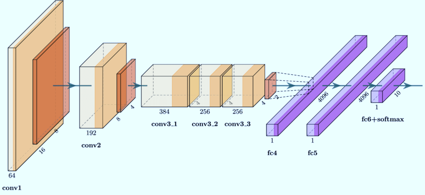
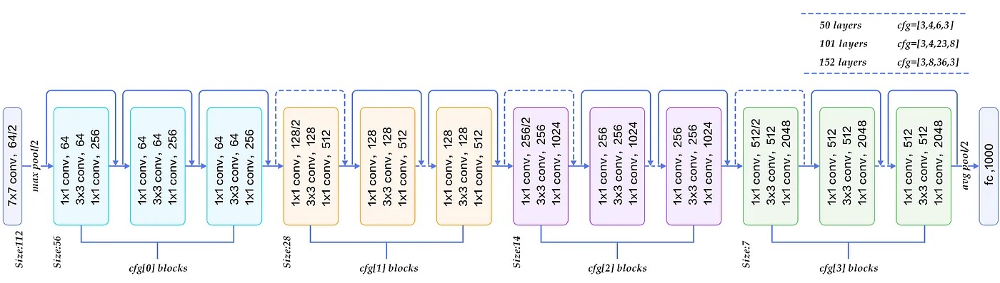
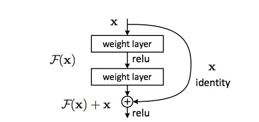
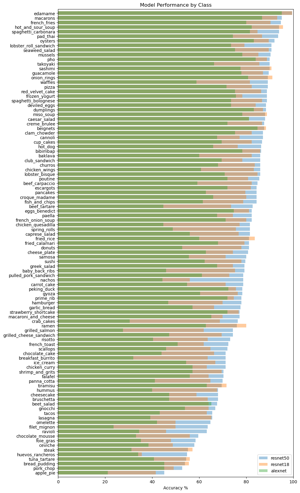

# PyTorch Image Classification with Food 101 dataset

Implementation of **Image Classification** models on [Food 101 Dataset](https://data.vision.ee.ethz.ch/cvl/datasets_extra/food-101/) in **PyTorch**

#### Table of Contents
- [Dataset](#dataset)
- [Model Architectures](#model-architecture)
- [Results](#results)
- [Quickstart](#quickstart)
    - [Training](#training)


## Dataset


The **Food-101 data set** consists of 101 food categories, with 101,000 images in total. The dataset is split into pre-defined train and test sets. Each image category includes 750 training images and 250 test images. 

For training, 20% of the training dataset is held and used for validation. All evaluation is performed on the test dataset. 

## Model Architectures

#### AlexNet
Pytorch implementation of [AlexNet](https://pytorch.org/vision/stable/models/alexnet.html) from [ImageNet Classification with Deep Convolutional Neural Networks](https://papers.nips.cc/paper/2012/hash/c399862d3b9d6b76c8436e924a68c45b-Abstract.html) paper. Network is pretrained on [ImageNet](https://image-net.org) and final fully connected layer is replaced with a 101-unit fully connected layer.


#### ResNet18, ResNet50
Implementation of models from [ResNet Convolutional Neural Network paper](https://arxiv.org/abs/1512.03385). For this task, [PyTorch implementations of ResNet18 and  ResNet50 models](https://pytorch.org/vision/stable/models/resnet.html), pretrained on [ImageNet](https://image-net.org), are used. 




**Skip Connections** add the original input to the output of the convolutional block


The final fully connected layer of the pretrained ResNet models is replaced with a 101-unit fully connected layer.

## Results
See [tensorboard](https://tensorboard.dev/experiment/9sZqKSmnSnK6UQJbNExzlQ/#scalars&run=alexnet&runSelectionState=eyJhbGV4bmV0Ijp0cnVlLCJyZXNuZXQxOCI6dHJ1ZX0%3D&_smoothingWeight=0) for full training experiment results. 


On the 25,250 image test set, the overall accuracy is **77%**. Accuracy varies by class and is shown below:




## Quickstart

With [conda](https://docs.conda.io/en/main/miniconda.html) installed, create and activate environment with the following bash commands:
```bash
>>> conda env create -f environment.yml
>>> conda activate py310_torch
```

### Training

```bash
python train.py --model Resnet --workers 8 --gpu True --epochs 1 --warm_start True
```
Optional parameters: 
- `--model`
    - Specifies model to train: 
        - `ConvNet`: Vanilla CNN 
        - `Resnet`: Resnet 50, pretrained on Imagenet
        - Can specify any new model by adding to `model.py`
- `--workers`: specifies number of workers for dataloaders
- `--gpu`: 
    - `True`: Runs on CUDA or MPS
    - `False`: Runs on CPU
- `--epochs`: Number of training cycles through full dataset
- `--warm_start`:
    - `True`: Loads pretrained model if prior training was run
    - `False`: Trains new model
